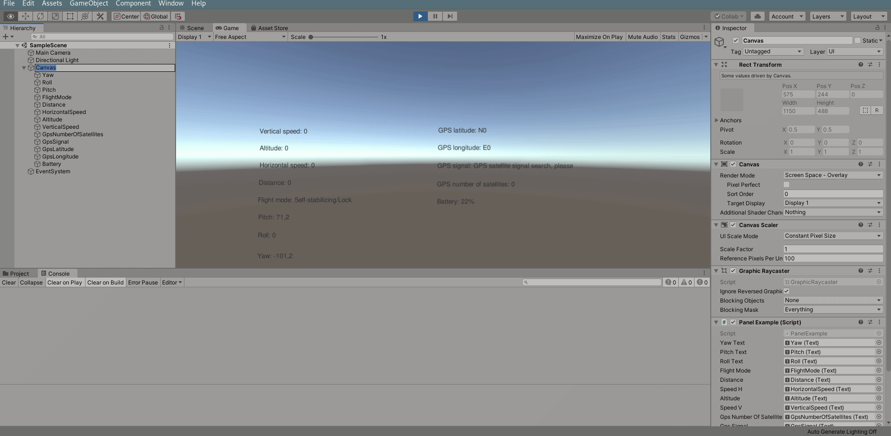

# Eachine e511s
Get the following data from eachine e511s drone.
- Vertical speed
- Horizontal speed
- Altitude speed
- Distance
- Flight mode
- Pitch
- Roll
- Yaw
- GPS latitude
- GPS longitude
- GPS signal
- GPS number of satellites
- Battery

